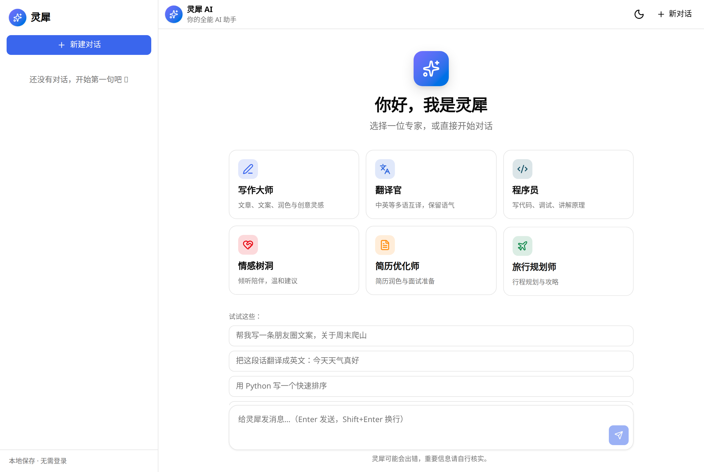
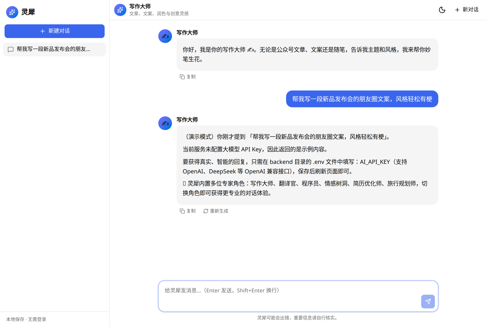

# Mornrain · AI 助手

> 开箱即用的多角色 AI 助手 Web 应用 —— 写作、翻译、编程、情感陪伴、简历优化、旅行规划，一个就够了。

[](LICENSE)
[](https://github.com)
[](https://github.com/mornrain-lin/Develop-website-using-scene-tool/actions/workflows/ci.yml)

**Mornrain** 是一款面向大众的 AI 助手，内置 6 位「专家角色」，支持流式对话、本地保存历史、明暗主题，无需登录、打开即用。后端基于 OpenAI 兼容接口对接主流大模型（OpenAI / DeepSeek 等），未配置密钥时自动进入「演示模式」，方便你先体验界面再接入自己的模型。

---

## ✨ 功能特性

- 🎭 **多专家角色**：写作大师、翻译官、程序员、情感树洞、简历优化师、旅行规划师，一键切换
- ⚡ **流式对话**：打字机式实时输出，可随时停止
- 💾 **本地历史**：对话自动保存在浏览器，刷新不丢，支持新建 / 切换 / 删除 / 重命名
- 📋 **消息操作**：复制、重新生成，支持 Markdown 与代码高亮、代码一键复制
- 🌗 **明暗主题**：浅色 / 深色两套配色，记忆你的偏好
- 📱 **响应式**：桌面侧边栏 + 移动端抽屉，手机电脑都好用

---

## 🖼️ 界面预览

| 欢迎页 | 角色对话 |
|--------|----------|
|  |  |

---

## 🛠️ 技术栈

| 层 | 技术 |
|----|------|
| 前端 | React 19 · Vite 7 · TypeScript · Tailwind CSS v4 · shadcn/ui · Framer Motion |
| 后端 | Express 4 · TypeScript · Node 原生 fetch 流式转发 |
| 模型 | 任意 OpenAI 兼容接口（OpenAI / DeepSeek / …） |

---

## 🚀 快速开始

> 需要 Node.js 18+ 与 [pnpm](https://pnpm.io)。

```bash
# 1. 克隆
git clone https://github.com/mornrain-lin/Develop-website-using-scene-tool.git
cd Develop-website-using-scene-tool

# 2. 启动后端
cd backend
pnpm install
cp .env.example .env      # 按需填写 AI_API_KEY（可先留空体验演示模式）
pnpm dev                  # 默认 http://localhost:3000

# 3. 启动前端（另开一个终端）
cd frontend
pnpm install
pnpm dev                  # 默认 http://localhost:5173
```

打开 http://localhost:5173 即可使用。

---

## ⚙️ 配置大模型

编辑 `backend/.env`：

```env
# 留空 = 演示模式（返回示例回复）
AI_API_KEY=sk-xxxx
# OpenAI 示例；DeepSeek 填 https://api.deepseek.com/v1
AI_BASE_URL=https://api.openai.com/v1
# 例如 gpt-4o-mini / deepseek-chat
AI_MODEL=gpt-4o-mini
```

支持任何 OpenAI 兼容接口；密钥仅保存在后端，不会暴露给前端。

---

## 🚀 部署

### 1) 配置真实模型

编辑 `backend/.env`（可复制 `backend/.env.example`）：

```env
# 留空 = 演示模式（返回示例回复）
AI_API_KEY=sk-xxxx

# OpenAI 示例
AI_BASE_URL=https://api.openai.com/v1
AI_MODEL=gpt-4o-mini

# DeepSeek 示例（二选一，把上面两行替换为）
# AI_BASE_URL=https://api.deepseek.com/v1
# AI_MODEL=deepseek-chat
```

支持任何 OpenAI 兼容接口；密钥只留在后端，不会暴露给前端。

### 2) 推荐：单服务部署（前后端同源）

后端会托管构建后的前端，前端用相对路径 `/api` 调用，无需额外跨域配置。

```bash
# 构建前端
cd frontend && pnpm install && pnpm build && cd ..
# 构建并启动后端（同时托管前端）
cd backend  && pnpm install && pnpm build && pnpm start
```

启动后访问 `http://<服务器>:3000` 即可（端口由 `PORT` 环境变量控制，默认 3000）。

**以 Render 为例**（Railway / Fly.io 同理）：

| 配置项 | 值 |
|--------|----|
| Build Command | `cd frontend && pnpm install && pnpm build && cd ../backend && pnpm install && pnpm build` |
| Start Command | `cd backend && pnpm start` |
| 环境变量 | `AI_API_KEY`、`AI_BASE_URL`、`AI_MODEL`、`PORT=3000`、`NODE_ENV=production` |

> 提示：若把前端与后端分开部署（如前端用 Vercel/Netlify、后端用 Render），需要在前端用环境变量或代理把 `/api` 指向后端地址，并在后端用 `CORS_ORIGIN` 放行对应域名。

### 3) 自托管（Nginx 反向代理）

```nginx
server {
  listen 80;
  server_name your-domain.com;

  location /api/ {
    proxy_pass http://127.0.0.1:3000;
    proxy_set_header Host $host;
    proxy_set_header X-Real-IP $remote_addr;
    proxy_set_header X-Forwarded-For $proxy_add_x_forwarded_for;
    proxy_set_header X-Forwarded-Proto $scheme;
  }

  location / {
    proxy_pass http://127.0.0.1:3000;
  }
}
```

把后端跑在 `3000`，Nginx 将 `/api` 与静态资源统一转发即可。

---

## 🤝 贡献

欢迎提 Issue 与 PR！无论是新增专家角色、优化界面，还是接入更多模型，都非常期待。

---

## 📄 开源协议

[MIT](LICENSE) · 随意使用、修改与分发。
